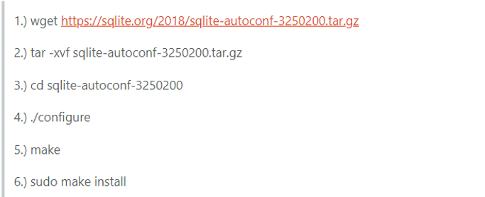

# Qt相关

## 界面开发(8.31)

1. 熟悉界面开发基本流程  

	*配置环境*  
	开发使用系统为Ubuntu18.04.5LTS,开发工具Qt Creator 5.9.9。  
	*项目简介*  
	Qt的项目文件为.pro文件，在其中添加一些语句可以实现功能的扩展，例如`qt += sql` qt中可以连接使用qsqlite 、qmysql、qpsql等。
	一般来说，生成项目包含以下几个部分，.pro为项目文件，headers为头文件文件夹，sources为源文件文件夹，forms为ui文件文件夹。可以通过右键添加文件，实现增添新的头文件、源文件的目的，可以通过添加文件，添加resources文件夹，项目所需要的图片、视频等可以在resources中进行配置。
	*三种基本窗体异同*  
	创建项目时，Qt提供了三种基本类，分别是QMainwindow,Qwidget,Qdialog。其中Qwideget时基类，剩下两种是继承Qwidget的，Qmainwindow增加了上方的控件栏，根据情况选择使用，Qdialog是对话框窗口的基类，是一个顶级窗体，用于短期任务和用户进行简要通讯。在没有特别的要求下，一般采用Qwidget即可完成开发.  
	

2. 学习信号槽基本知识()  

3. 学习常用控件基本知识  

4. 学习软件架构基本知识  

5. 学习TCP/IP通信知识  

## 数据库使用(9.5)  

1. 学习SQLITE数据库读写基本知识  

2. 学习SQLITE数据库查询基本知识 

 
3. 了解数据导出和文件存储基本知识  

##多线程(9.15)  

1. 了解多线程基本知识  

2. 了解Qt建立线程的方法

3. 学习信号槽和多线程的关联  

4. 熟悉SA05项目中的特殊线程（共享内存、抓拍机）

##http通信(9.30)  

1. 了解http通信基本知识  

2. 了解joson格式

3. 实现基本的http通信

##软件调试(10.31)

##软件维护

*斜体*  
`code here`
  //引入图片  

