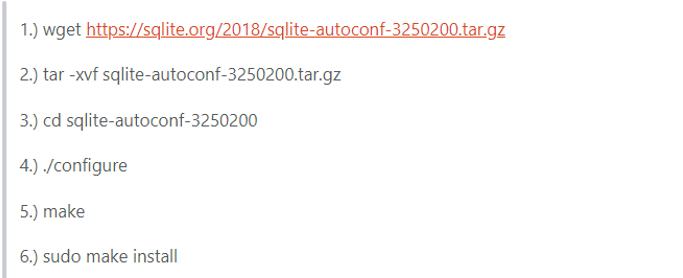

# bugNotes

## Ubuntu使用

1. Error1  
*nautilus无法打开 终端可以正常显示文件*  
step1.清除安装路径下的三个文件夹  
step2.重启系统  
如果依旧不行，参考以下过程  
链接：https://askubuntu.com/questions/1087345/nautilus-symbol-lookup-error-usr-lib-x86-64-linux-gnu-tracker-2-0-libtracker/  
  
	wget https://sqlite.org/2018/sqlite-autoconf-3250200.tar.gz  
	tar -xvf sqlite-autoconf-35250200.tar.gz  
	cd sqlite-autoconf-3250200
	./configure
	make
	sudo make install

## Qt开发过程  

*

